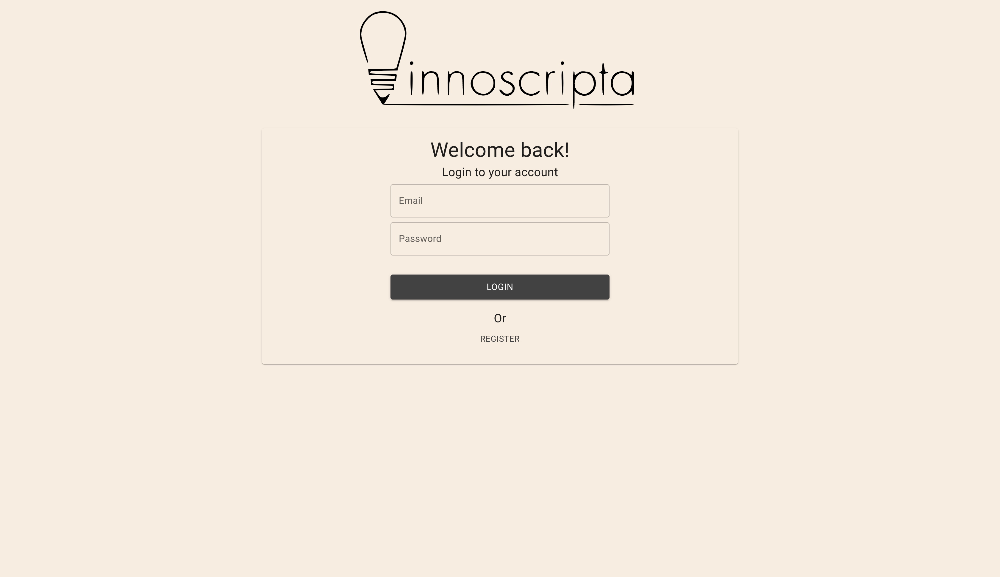

# Innoscripta Fullstack Developer Challenge

A news aggregator website that pulls articles from various sources and displays them in a clean and easy-to-read format

## Installation

-   Clone the repository:
    Copy and run the following command in your terminal:

```bash
git clone https://github.com/davydocsurg/innoscripta-fullstack-challenge.git
```

-   Navigate to the project's root directory and run the following command to build a docker image:

```bash
docker compose up --build
```

This will build and startup the development server for the `frontend` and `backend`

## BACKEND

## End Points

### PUBLIC ROUTES

The following routes DON'T require authentication

#### POST /api/register

Registers a user

#### POST /api/login

Logs in a user

### PUBLIC ROUTES

The following routes REQUIRE authentication

#### POST /api/articles/search

Search for articles

#### GET /api/user/settings

Fetch logged in user Settings

#### PATCH /api/user/settings

Update logged in user settings

## FRONTEND

The frontend runs at port `3000` and has 3 pages:

-   login: http://localhost:3000/
    

-   register: http://localhost:3000/register
    

-   dashboard: http://localhost:3000/dashboard
    
